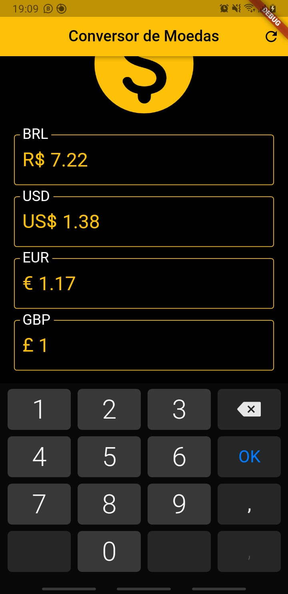
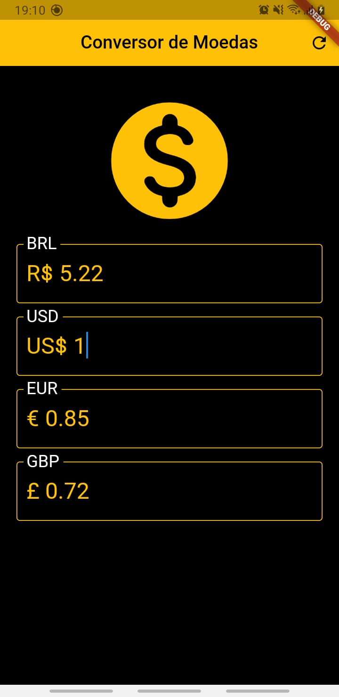
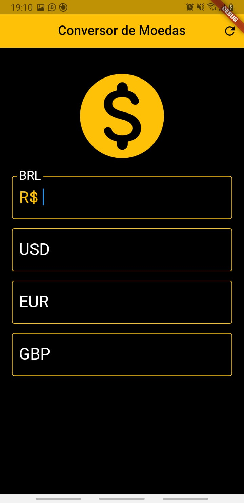

# conversor_de_moedas

My third Flutter project.

This simple app serves to convert one currency into another based on data consumed via API and learn
more about Flutter. It's my third app made with Flutter. I used the knowledge acquired in previous
projects ([contador_de_pessoas](https://github.com/henriqueparaguassu/contador_de_pessoas)
, [calculadora_imc](https://github.com/henriqueparaguassu/calculadora_imc)) and took the opportunity
to learn more about: http requests with Dart, the Future type, the FutureBuilder widget, a little
about creating a theme and I went deeper into previous widgets.

## Screenshots

For help getting started with Flutter, view our
[online documentation](https://flutter.dev/docs), which offers tutorials,
samples, guidance on mobile development, and a full API reference.
